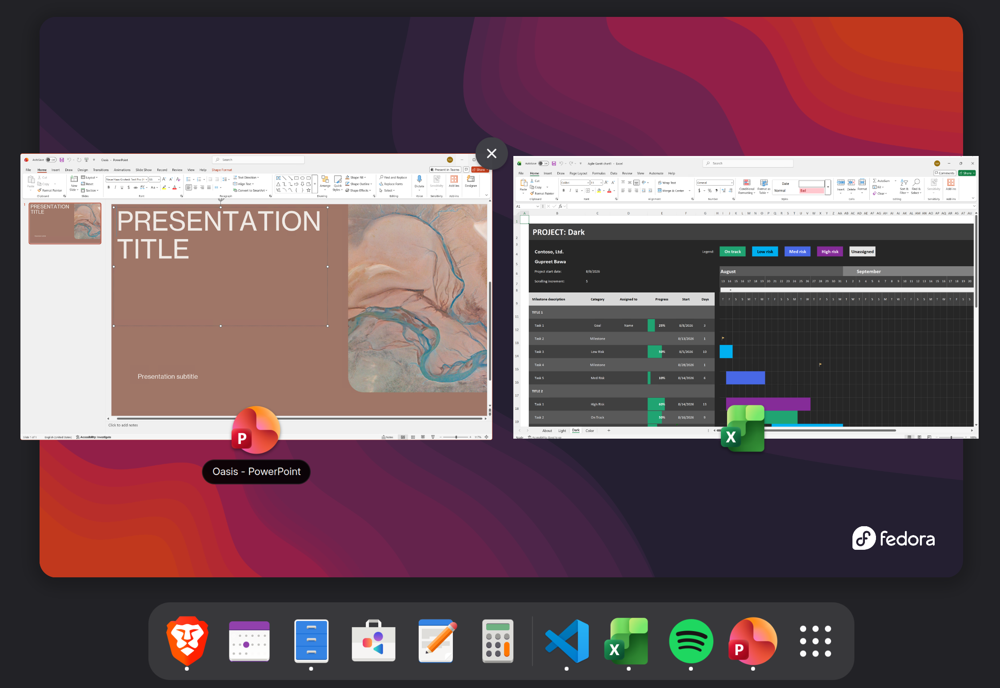

<div align="center">


# fast-msoffice-linux

**Excel and PowerPoint on Linux, in real windows, at real speed.**

They get a taskbar entry, an alt-tab slot and the proper Office icons.
The Windows VM doing the work never shows itself.

<br>

[](LICENSE)
[](#what-you-need)
[](#how-it-works)
[](https://github.com/whitehole07/fast-msoffice-linux/stargazers)

[Get started](#get-started) · [Why bother](#why-bother) · [Speed](#speed) · [Full guide](GUIDE.md)

<br>



<sub>PowerPoint and Excel in the GNOME overview, each with its own icon. No Windows desktop anywhere.</sub>

</div>

---

## Get started

```bash
git clone https://github.com/whitehole07/fast-msoffice-linux
cd fast-msoffice-linux

./install.sh      # installs Windows and Office, no questions asked
./powerpoint.sh   # a real PowerPoint window
```

One thing you have to do yourself: grab a
[Windows 11 ISO](https://www.microsoft.com/software-download/windows11) and drop
it in `vm/iso/`. Microsoft hands out session-scoped download links and blocks
scripted requests, so nobody can automate that part reliably. No product key and
no account needed.

After that you can walk away. Windows partitions the disk, installs itself,
makes an account, applies all the tuning below, pulls down Office, and puts
Excel and PowerPoint in your application menu.

**[Read the full guide →](GUIDE.md)**

---

## Why bother

Office on Linux usually means picking which compromise annoys you least:

| | |
|---|---|
| Office Online | It's a browser tab |
| LibreOffice | Complex `.pptx` files come out wrong |
| Wine | Microsoft 365 won't even install. Click-to-Run dies before writing a log |
| A plain VM | Works fine, but now you're using a Windows desktop inside a window |

And if you rely on a PowerPoint add-in, none of those help at all. Ribbon
integration and COM automation need genuine Windows.

So this uses a VM, but hides it. RDP has a feature called RemoteApp that sends
a single application's window instead of the whole desktop. Windows runs
headless in the background and Office just sits on your desktop like anything
else.

---

## Speed

Typing, scrolling, dragging shapes around, slide animations: it all feels
local. KVM runs the guest on your actual CPU, so there's no emulation
overhead to begin with, and the setup ships tuned:

- **VBS off.** Windows 11 runs a hypervisor inside your VM by default for
  Memory Integrity. Nested virtualisation slows down everything. Turning it off
  is the single biggest win here.
- **13 Hyper-V enlightenments.** Paravirtualised timers, interrupts and
  spinlocks, so Windows stops busy-waiting on things.
- **60 fps compositing.** Windows caps RDP around 30 by default.
- **H.264 AVC420.** Half the encoding work of 4:4:4, and you notice it most
  when dragging objects.
- **Office hardware acceleration off.** There's no GPU, so Office's Direct3D
  path falls back to a software rasteriser that's slower than just drawing
  normally.
- **virtio networking**, 6 vCPUs, RDP over loopback.

All of it applied for you. Most guides to running Office in a VM skip these,
which is why this probably feels different from VMs you've tried before.

---

## It stays in one folder

Nothing gets installed on your system. QEMU is called directly with no libvirt
daemon anywhere, and FreeRDP is unpacked into `opt/` instead of installed.

```bash
./lib/setup-desktop.sh --remove   # takes the menu entries back out
rm -rf fast-msoffice-linux        # Windows, Office, the VM, gone
```

---

## Using it

| Command | |
|---|---|
| `./powerpoint.sh`, `./excel.sh` | Office, as normal windows |
| `./desktop.sh` | Full Windows desktop, handy for installing add-ins |
| `./vm.sh start` · `headless` · `stop` · `status` | Control the VM |
| `./lib/setup-desktop.sh --remove` | Remove the menu entries |

Launching an app starts the VM if it isn't already up. Your home directory is
mounted inside Windows, so your files stay where they are.

---

## How it works

```
   your desktop                      inside the VM
  ┌───────────────┐                ┌──────────────────┐
  │ PowerPoint    │◄── RemoteApp ──┤ PowerPoint       │
  │ window        │     over RDP   │ (real Windows)   │
  └───────────────┘                └──────────────────┘
        FreeRDP  ────── loopback ──────►  QEMU/KVM
```

KVM runs the guest on your CPU. QEMU provides the virtual hardware, with no
libvirt involved. swtpm fakes the TPM 2.0 chip that Windows 11 insists on.
OVMF is the UEFI firmware. RemoteApp publishes one app rather than a desktop,
and FreeRDP draws it as a native window.

---

## What you need

- A CPU with virtualisation (VT-x or AMD-V), about 80 GB of disk, 16 GB of RAM
  is comfortable
- A Microsoft 365 subscription for Office. Windows itself needs no licence key
- `qemu-kvm swtpm swtpm-tools edk2-ovmf genisoimage cpio curl`

Windows installs and runs indefinitely without activation. You get a watermark
and you can't change the wallpaper. Nothing else is restricted, and Office is
licensed by your subscription either way.

---

<div align="center">
<sub>MIT licensed. Not affiliated with Microsoft.</sub>
</div>
